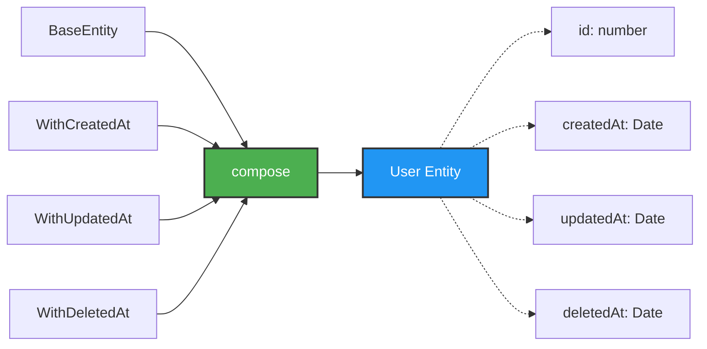

# NestJS Mixins Example

A simple example project demonstrating how to use **TypeScript mixins** with NestJS for entities and services.

Here I'm using `typeorm` with `sqlite`

## What is this?

This project shows a practical implementation of mixins in NestJS to:

- Add reusable properties to **entities** (timestamps like `createdAt`, `updatedAt`, `deletedAt`)
- Add reusable methods to **services** (CRUD operations)

## How Mixins Work



The `compose` function takes a base class and multiple mixins, then combines them into a single class with all properties and methods.

## ⚠️ Important Note

**TypeScript supports mixins** through a pattern that uses successive class extensions. Behind the scenes, the `compose` function creates a chain of classes that extend each other:

```typescript
// This:
compose(BaseEntity, WithCreatedAt, WithUpdatedAt, WithDeletedAt);

// Creates a chain like:
class Temp1 extends BaseEntity {}
class Temp2 extends WithCreatedAt(Temp1) {}
class Temp3 extends WithUpdatedAt(Temp2) {}
class Final extends WithDeletedAt(Temp3) {}
```

**This pattern has limitations with NestJS:**

- Dependency injection decorators (`@InjectRepository()`, etc.) don't work inside mixin classes
- You need workarounds like base classes for constructor injection (see `UserServiceBase` in the code)

## Example Usage

**Entity with timestamp mixins:**

```typescript
@Entity()
export class User extends compose(
  BaseEntity,
  WithCreatedAt,
  WithUpdatedAt,
  WithDeletedAt,
) {
  @PrimaryColumn()
  id: number;
}
```

**Service with CRUD mixin:**

```typescript
@Injectable()
export class UserService extends compose(
  UserServiceBase,
  WithCrud<User, number>('id'),
) {}
```

This gives you `create()`, `read()`, `update()`, and `delete()` methods automatically.

## Getting Started with pnpm

Install dependencies:

```bash
pnpm install
```

Run in development mode:

```bash
pnpm run start:dev
```

The API will be available at `http://localhost:3000`
